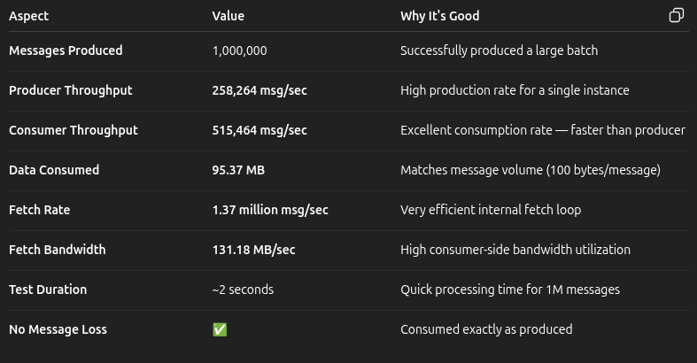
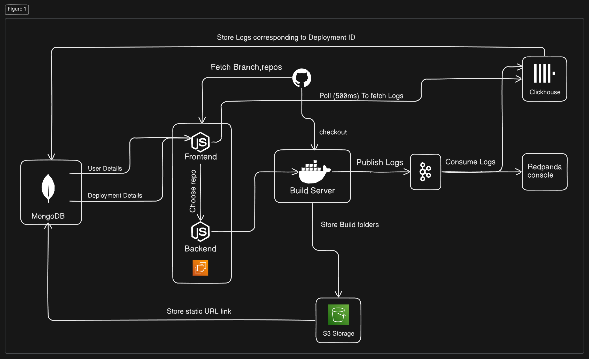

# Vortex

Vortex is a **cloud-native deployment service** inspired by **Vercel**, designed for **static website hosting**.  
It features **Node.js microservices**, a **Kafka-based log pipeline**, and a **modern React frontend** to provide a scalable and seamless user experience.

---

## 📊 Performance Results

  

---

## 🏗️ Architecture

  

---

## 📖 Documentation

For detailed architecture, workflows, and implementation details, check out the documentation files in the [docs](./docs/) directory:

- [Chapter 1: User Authentication & Management](./docs/01_user_authentication___management_.md)
- [Chapter 2: GitHub Integration](./docs/02_github_integration_.md)
- [Chapter 3: Project Deployment Lifecycle](./docs/03_project_deployment_lifecycle_.md)
- [Chapter 4: Real-time Build Log Pipeline](./docs/04_real_time_build_log_pipeline_.md)
- [Chapter 5: Frontend State Management](./docs/05_frontend_state_management_.md)
- [Chapter 6: Service Orchestration](./docs/06_service_orchestration_.md)
- [Chapter 7: Persistent Data Storage](./docs/07_persistent_data_storage_.md)
- [Chapter 8: System Architecture & Topology](./docs/08_architecture.md)
- [Chapter 9: CI/CD Automation Pipeline](./docs/09_cicd.md)
- [Chapter 10: Infrastructure Provisioning with Terraform](./docs/10_terraform.md)

---

