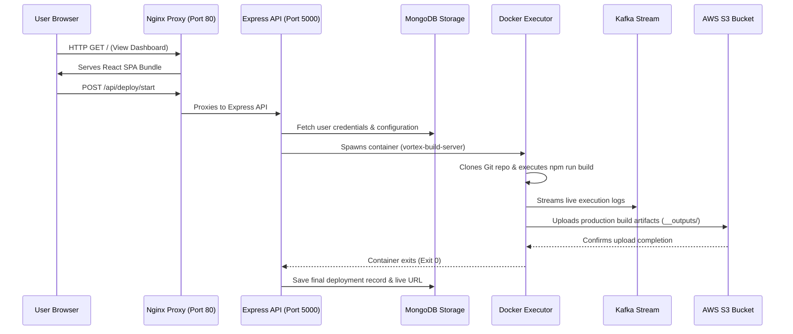

# Chapter 8: System Architecture & Topology

Welcome back! In our previous chapter, [Chapter 7: Persistent Data Storage](07_persistent_data_storage_.md), we learned how Vortex uses MongoDB as its long-term memory to permanently save user accounts, project settings, and deployment histories across system restarts.

Now, let's step back and look at the big picture: how do all these individual pieces—the React frontend, Express API backend, Kafka streaming engine, ClickHouse analytics database, MongoDB storage, and AWS S3 static hosting—fit together into a single, cohesive, cloud-native platform?

This master blueprint is called the **System Architecture & Topology**. Understanding this topology shows you how Vortex delivers near-instant build processing, high-availability routing, and seamless scalability.

---

### Your First Step: Understanding the Master Blueprint

The core objective of System Architecture & Topology is to **organize complex software components into dedicated, isolated layers that communicate seamlessly through secure interfaces and high-speed networks.**

**How it works from your perspective:**

1. **Single Entry Point (`http://localhost`):** You access the platform through Nginx, which acts as the digital front door, instantly routing your browser to either the frontend user interface or the backend API.
2. **Decoupled Microservices:** The API server handles logic and authentication, while heavy construction (building your websites) is offloaded to dynamic background Docker containers.
3. **High-Speed Telemetry:** As your project builds, streaming events flow through Apache Kafka directly into ClickHouse without slowing down your main application database.
4. **Cloud Asset Hosting:** Your final production website is delivered straight to Amazon S3 in your chosen cloud region for global availability.

---

### The Digital Metropolis: Key Concepts

Vortex's system architecture can be understood like a modern digital metropolis, where each district performs a specialized role:

| Component | Analogy | What it does in Vortex |
| :--- | :--- | :--- |
| **Nginx Reverse Proxy** | The City Gatekeeper & Traffic Officer | Receives incoming HTTP requests on port 80 and routes them to the frontend UI or backend API. |
| **Express Backend API** | The Central Command Center | Handles user authentication, database queries, and triggers dynamic container deployments. |
| **React Frontend SPA** | The Interactive Showroom | Renders the modern user interface, managing live dashboards, forms, and real-time log displays. |
| **Docker Build Executor** | The Specialized Construction Crew | Isolated containers that spin up on demand to clone, build, and package user code repositories. |
| **Kafka & ClickHouse** | High-Speed Railway & Analytics Vault | Kafka streams build logs at high throughput; ClickHouse stores and queries analytical logs instantly. |
| **MongoDB Database** | The Secure Archives | Stores persistent state, user profiles, authentication credentials, and deployment metadata. |
| **AWS S3 Cloud Storage** | Global Warehouse & Distribution | Hosts the final static site assets (HTML, CSS, JS) accessible worldwide with zero downtime. |

---

### How Vortex Operates (Under the Hood)

Let's trace how a full deployment request traverses every layer of the Vortex system topology:



---

### A Peek at the Code

Let's look at the actual code configurations that connect these distributed systems together into a unified platform.

#### 1. Unified Edge Routing (`nginx/nginx.conf`)

Nginx acts as the single entry gateway, eliminating CORS issues by proxying frontend traffic and API routes cleanly:

```nginx
# nginx/nginx.conf (Simplified Topology Routing)
server {
    listen 80;
    server_name localhost;

    # Route API requests directly to Express Backend Microservice
    location /api/ {
        proxy_pass http://application:5000/api/;
        proxy_http_version 1.1;
        proxy_set_header Upgrade $http_upgrade;
        proxy_set_header Connection 'upgrade';
        proxy_set_header Host $host;
        proxy_cache_bypass $http_upgrade;
    }

    # Route static application traffic to React SPA
    location / {
        proxy_pass http://application:3000/;
        proxy_http_version 1.1;
        proxy_set_header Host $host;
    }
}
```

*What this code does:* This Nginx configuration listens on port 80. When a browser requests `/api/auth/login` or `/api/deploy/start`, Nginx seamlessly passes the request to `http://application:5000`. All other root traffic is forwarded to `http://application:3000`. This provides a single unified domain for the user.

#### 2. Multi-Container Orchestration Topology (`services/docker-compose.yml`)

The infrastructure topology defines network links, dependencies, and environment variable bindings across containers:

```yaml
# services/docker-compose.yml (Core Topology Excerpt)
services:
  mongodb:
    image: mongo:6.0
    container_name: mongodb
    ports:
      - "27017:27017"
    volumes:
      - mongo_data:/data/db

  clickhouse:
    image: clickhouse/clickhouse-server:23.4
    container_name: clickhouse
    ports:
      - "8123:8123"

  application:
    build:
      context: ..
      dockerfile: Dockerfile
    container_name: vortex-app
    depends_on:
      mongodb:
        condition: service_healthy
      clickhouse:
        condition: service_healthy
    ports:
      - "3005:3000"
      - "5000:5000"
    volumes:
      - /var/run/docker.sock:/var/run/docker.sock
    env_file:
      - ../.env
```

*What this code does:* This Docker Compose configuration defines the runtime topology. The backend `application` container depends on healthy `mongodb` and `clickhouse` instances before launching. Mounting `/var/run/docker.sock` grants the backend container permission to dynamically launch ephemeral build server containers on demand.

---

### Conclusion

In this chapter, we explored the complete **System Architecture & Topology** of Vortex. You learned how Nginx, Express, React, Docker, Kafka, ClickHouse, MongoDB, and AWS S3 unite into a multi-tiered ecosystem. By isolating build executions in ephemeral Docker containers and streaming logs through high-throughput pipelines, Vortex ensures enterprise-grade stability, security, and scalability.

[Next Chapter: Infrastructure_as_code and continous deployment](09_infrastructure_as_code_and_continuous_deployment.md)

---

