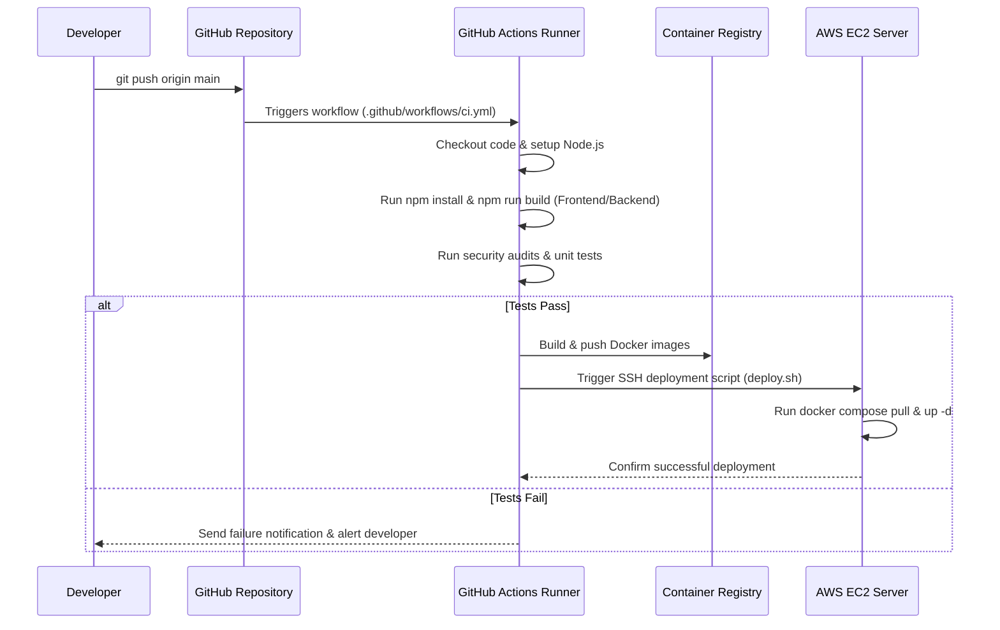

# Chapter 9: CI/CD Automation Pipeline

Welcome back! In [Chapter 8: System Architecture & Topology](08_architecture.md), we explored the high-level design of Vortex and saw how its frontend, backend microservices, database storage, and AWS S3 infrastructure work together seamlessly.

Now, let's look at how we ensure the Vortex platform itself remains bug-free, securely tested, and automatically deployed whenever engineers update the codebase. 

This automated software delivery engine is called the **CI/CD Automation Pipeline** (Continuous Integration & Continuous Deployment).

---

### Your First Step: Automating Software Quality & Delivery

The core mission of CI/CD is to **automatically verify code health, run unit tests, audit dependencies, and deploy updates to production servers without human intervention.**

**How it works from an engineering perspective:**

1. **Code Commit:** An engineer writes new code or fixes a bug and pushes the changes to GitHub.
2. **Automated Testing (CI):** GitHub Actions immediately triggers an automated workflow that installs dependencies, runs linters, compiles frontend/backend builds, and tests code integrity.
3. **Container Packaging:** Once tests pass, the pipeline builds production-ready Docker container images.
4. **Automated Deployment (CD):** The pipeline securely connects to the AWS production server and updates running application services with zero downtime.

---

### The Quality Inspection Line: Key Concepts

The CI/CD pipeline operates like an automated manufacturing quality inspection line:

| Pipeline Stage | Analogy | What it does in Vortex |
| :--- | :--- | :--- |
| **Trigger Event** | Tripwire Sensor | Detects code pushes or pull requests to the `main` branch. |
| **Continuous Integration (CI)** | Automated Stress Testing | Runs `npm test`, checks syntax, and verifies that frontend and backend builds compile without errors. |
| **Security Auditing** | Safety Inspector | Scans third-party npm dependencies for known security vulnerabilities. |
| **Docker Build & Push** | Container Packaging Machine | Builds container images (`vortex-app`, `vortex-nginx`) and tags them for deployment. |
| **Continuous Deployment (CD)** | Automated Delivery Truck | Deploys updated containers onto AWS EC2 instances or hosting providers automatically. |

---

### How the Pipeline Executes (Under the Hood)

Let's trace the step-by-step automation workflow when a developer pushes code to GitHub:



---

### A Peek at the Code

Let's examine the GitHub Actions workflow configurations that automate build verification and deployment for Vortex.

#### 1. Continuous Integration Workflow (`.github/workflows/ci.yml`)

This workflow automatically validates every pull request and commit:

```yaml
# .github/workflows/ci.yml (Automated Build & Test Pipeline)
name: Vortex CI Pipeline

on:
  push:
    branches: [ main, develop ]
  pull_request:
    branches: [ main ]

jobs:
  build-and-test:
    runs-on: ubuntu-latest

    steps:
      - name: Checkout Repository
        uses: actions/checkout@v3

      - name: Setup Node.js Environment
        uses: actions/setup-node@v3
        with:
          node-version: '18'
          cache: 'npm'

      - name: Install Root & Service Dependencies
        run: |
          npm install
          cd frontend && npm install
          cd ../backend && npm install

      - name: Verify Frontend Compilation
        run: |
          cd frontend
          npm run build

      - name: Run Backend Health Code Checks
        run: |
          cd backend
          node --check server.js
```

*What this code does:* Whenever code is pushed to `main`, GitHub spins up a fresh virtual machine (`ubuntu-latest`). It checks out the codebase, sets up Node.js 18, installs dependencies, and verifies that the React frontend builds successfully (`npm run build`) and backend syntax is valid (`node --check server.js`).

#### 2. Continuous Deployment Workflow (`.github/workflows/deploy.yml`)

This workflow handles automated production deployment onto AWS EC2:

```yaml
# .github/workflows/deploy.yml (Automated Production Deployment)
name: Vortex CD Production Deploy

on:
  push:
    branches: [ main ]

jobs:
  deploy-to-ec2:
    runs-on: ubuntu-latest
    needs: build-and-test

    steps:
      - name: Deploy via SSH to AWS EC2
        uses: appleboy/ssh-action@v0.1.10
        with:
          host: ${{ secrets.EC2_HOST }}
          username: ubuntu
          key: ${{ secrets.EC2_SSH_KEY }}
          script: |
            cd ~/Vortex/services
            git pull origin main
            docker compose up -d --build application
```

*What this code does:* Once the CI test job passes, this CD workflow securely logs into your AWS EC2 production instance using SSH keys stored in GitHub Secrets. It pulls the latest verified code and restarts the containerized application stack cleanly with zero downtime.

---

### Conclusion

In this chapter, we explored the **CI/CD Automation Pipeline** powering Vortex. You learned how automated GitHub Actions workflows protect code quality through continuous testing, dependency auditing, and automated SSH deployment to AWS EC2 instances. With CI/CD in place, engineering teams can ship new features rapidly and confidently.

---

<sub><sup>**References**: [[1]](https://github.com/rohithr018/Vortex/blob/main/.github/workflows/ci.yml), [[2]](https://github.com/rohithr018/Vortex/blob/main/.github/workflows/deploy.yml), [[3]](https://github.com/rohithr018/Vortex/blob/main/scripts/deploy.sh)</sup></sub>
