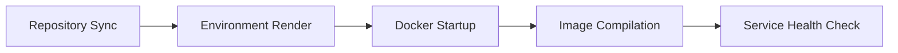
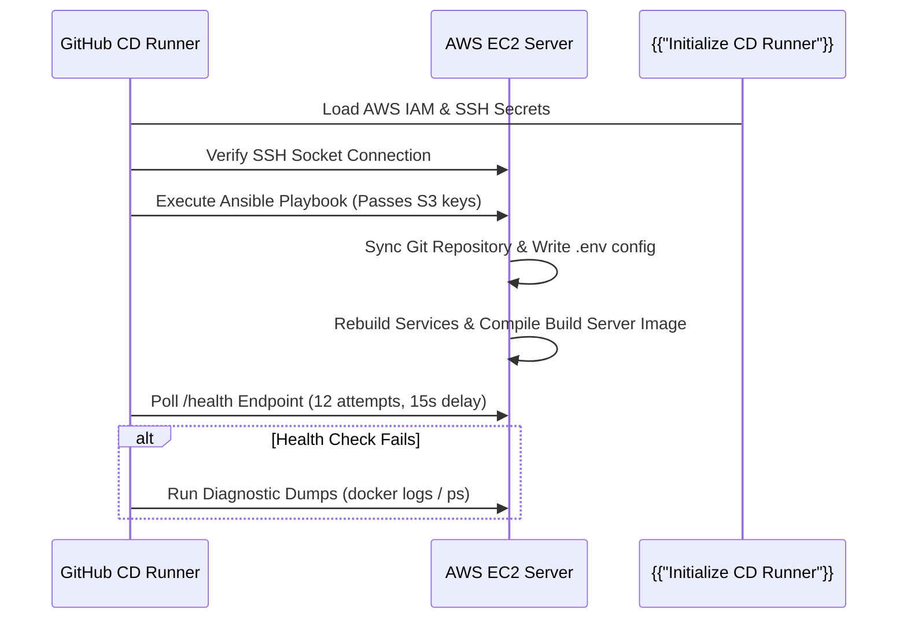

# Chapter 9: Infrastructure as Code & Continuous Deployment

Welcome back! In our previous chapter, [Chapter 8: System Architecture & Topology](08_architecture.md), we explored the macro blueprint of the Vortex platform and saw how its individual microservices connect.

Now, how do we provision the underlying servers in the cloud and automate the deployment of this entire stack with zero manual intervention? 

This is where **Infrastructure as Code (IaC)** and **Continuous Deployment (CD)** pipelines come to life. In this chapter, we will learn how Vortex uses Terraform to build networking and compute resources, Ansible to configure and boot containers, and GitHub Actions to automate it all on every commit.

---

### Your First Step: The Automated Pipeline

The core goal of IaC and CD is to **define your entire hardware architecture and server settings in version-controlled files, enabling automated deployment pipelines to deploy, compile, and configure the code securely and idempotently.**

**How it works from a DevOps perspective:**
1. **Infrastructure Provisioning (Terraform):** Declares your server resources, VPC networks, and firewall rules in code. Running Terraform creates this infrastructure exactly the same way every time.
2. **Configuration Management & Deployment (Ansible):** Orchestrates package installations, compiles configurations, and deploys the multi-container Docker Compose stack on the remote host.
3. **Continuous Integration (GitHub Actions CI):** Checks the codebase for syntax errors, executes linting, runs test suites, and performs dependency security scans on every Pull Request.
4. **Continuous Deployment (GitHub Actions CD):** Automatically logs into the EC2 instance, executes the Ansible playbook, and runs real-time container health checks after code merges into the `main` branch.

---

### The DevOps Engine: Key Concepts

Let's look at the tooling and directories that power Vortex's deployment lifecycle:

| Component / Layer | Role | What it manages in Vortex |
| :--- | :--- | :--- |
| **Terraform (`infra/terraform/`)** | The Cloud Architect | Provisions the VPC, Security Groups, EC2 compute instance, Elastic IP allocation, and virtual memory (swap configuration). |
| **Ansible Playbook (`infra/ansible/`)** | The Server Orchestrator | Installs Docker, clones the repository, deploys `.env` templates, builds the Compose services, compiles the build server image, and restarts components. |
| **GitHub Actions CI (`ci.yml`)** | The Quality Gatekeeper | Automatically compiles code, runs test suites, and scans files for secrets or dependency vulnerabilities before merging. |
| **GitHub Actions CD (`cd.yml`)** | The Automatic Shipper | Automatically logs into EC2 over SSH, triggers Ansible playbooks, runs health loops, and outputs logs if services fail. |

---

### Provisioning Compute & Networking (Terraform)

Vortex's cloud footprint is fully described in [infra/terraform/main.tf]. The layout maps out a secure public subnet VPC, attaches a static IP (Elastic IP) for stable routing, and configures a `t2.small` EC2 instance with custom startup scripts.

#### Memory Optimization (Swap Space)
Because building React applications and compiling container images are memory-intensive tasks, running them on a standard `t2.small` instance (2 GiB RAM) can trigger Out Of Memory (OOM) crashes. 

To solve this, Vortex's Terraform configuration provisions **4 GiB of swap space** during initial boot. This doubles the virtual memory capacity and ensures stable builds.

#### Terraform Configuration Excerpt (`infra/terraform/main.tf`):
```hcl
# EC2 Instance Configuration
resource "aws_instance" "vortex_host" {
  ami           = "ami-007020fd9c84e18c7" # Ubuntu 24.04 LTS
  instance_type = "t2.small"
  subnet_id     = aws_subnet.public.id
  key_name      = var.key_name

  vpc_security_group_ids = [aws_security_group.vortex_sg.id]

  # User data script to configure swap memory on initial boot
  user_data = <<-EOF
              #!/bin/bash
              echo "Creating 4GB swap space..."
              fallocate -l 4G /swapfile
              chmod 600 /swapfile
              mkswap /swapfile
              swapon /swapfile
              echo '/swapfile none swap sw 0 0' >> /etc/fstab
              echo "Swap space successfully created!"
              EOF

  tags = {
    Name = "Vortex Production Host"
  }
}
```

---

### Configuration Management & Deploy (Ansible)

Once the cloud server is online, Ansible configures the OS, installs requirements, and starts the container stack. This is driven by the modular Ansible role located at `infra/ansible/roles/vortex/`.

#### Ansible Playbook Task Topology
The deployment process is organized into distinct phases inside `tasks/main.yml`:



1. **`repository.yml`**: Clones and syncs the latest git commits from your branch into `/home/ubuntu/vortex`.
2. **`env.yml`**: Renders the dynamic environment template `.env.j2` containing database strings, Kafka addresses, and AWS credentials.
3. **`deploy.yml`**: Pulls Docker base images, builds code, launches the services (`docker compose up -d --build`), and compiles the `vortex-build-server` image on the host.
4. **`health.yml`**: Monitors the `vortex-app` container until it registers as `"healthy"`, verifies Nginx proxy access, and checks that the build server image is active on the Docker daemon.

#### Dynamic Secret Injection (`infra/ansible/roles/vortex/templates/.env.j2`)
To prevent exposing secret keys in public code repositories, Ansible reads S3 bucket keys from the runner environment using lookup plugins and writes them dynamically to the host's `.env` file:

```jinja2
# AWS S3 Cloud Storage Credentials (Generated by Ansible)
AWS_REGION={{ aws_s3_region }}
AWS_ACCESS_KEY_ID={{ aws_access_key_id }}
AWS_SECRET_ACCESS_KEY={{ aws_secret_access_key }}
S3_BUCKET={{ s3_bucket }}
```
*Note: `aws_access_key_id` maps to `{{ lookup('env', 'AWS_ACCESS_KEY_ID') }}` which pulls the secret from the GitHub Actions CD environment during runs.*

#### Resolving Nginx Upstream DNS Cache (`infra/ansible/roles/vortex/handlers/main.yml`)
When Docker Compose recreates the backend container during deployment, it receives a new internal IP address. If Nginx is simply restarted, it caches the old IP, causing persistent `502 Bad Gateway` errors. 

To solve this, Vortex uses a clean `down/up` handler sequence to rebuild the network namespaces:

```yaml
- name: Restart Docker services
  ansible.builtin.shell:
    cmd: docker compose -f {{ docker_compose_file }} down && docker compose -f {{ docker_compose_file }} up -d
  changed_when: true
```

---

### Automation Pipelines (GitHub Actions)

Vortex automates testing and deployments using two GitHub Action workflows:

#### 1. Continuous Integration (`.github/workflows/ci.yml`)
Runs on all Pull Requests targeting `main`. It runs:
* **Linting & Verification**: Validates Node.js files, React builds, and Docker Compose configurations.
* **Terraform Checks**: Executes `terraform fmt` and `terraform validate`.
* **Security Scanning**: Scans for leaked credentials, checks code quality, and performs dependency audits.

#### 2. Continuous Deployment (`.github/workflows/cd.yml`)
Triggers automatically whenever code is pushed or merged into the `main` branch.



The GHA runner passes the AWS IAM credentials from GitHub secrets to `ansible-playbook`, ensuring they are compiled into the `.env` configuration file on the EC2 host. If the health check fails, a fail-safe diagnostics dump is printed to the runner log to simplify troubleshooting.

---

### Conclusion

In this chapter, we explored **Infrastructure as Code & Continuous Deployment** in Vortex. You learned how Terraform, Ansible, and GitHub Actions work together to automate infrastructure provisioning, compile dynamic configurations, bypass Nginx DNS cache issues, and verify that the system is fully healthy.

---

<sub><sup>**References**: [[1]](https://github.com/Eshwarsai-07/Vortex/tree/main/infra/terraform), [[2]](https://github.com/Eshwarsai-07/Vortex/blob/main/infra/ansible/playbook.yml), [[3]](https://github.com/Eshwarsai-07/Vortex/tree/main/.github/workflows)</sup></sub>
