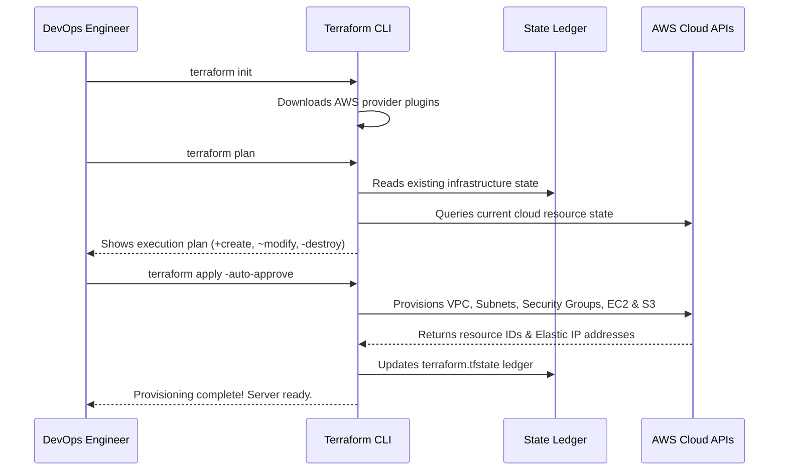

# Chapter 10: Infrastructure Provisioning with Terraform

Welcome back! In [Chapter 9: CI/CD Automation Pipeline](09_cicd.md), we explored how software changes are automatically tested and deployed to cloud servers. 

Now, let's answer a fundamental question: where do those cloud servers, virtual networks, and storage buckets come from in the first place? Instead of manually clicking buttons in the AWS Console, Vortex defines its entire cloud infrastructure using code!

This paradigm is called **Infrastructure as Code (IaC)**, powered by **Terraform**.

---

### Your First Step: Provisioning Cloud Infrastructure with Code

The primary mission of Terraform in Vortex is to **automatically declare, provision, and configure AWS cloud resources—such as EC2 compute instances, VPC networking, security groups, and S3 buckets—in a reproducible and version-controlled format.**

**How it works from an infrastructure engineer's perspective:**

1. **Declarative Configuration:** You write code in `.tf` files stating exactly what infrastructure you need (e.g., "I need one `t3.medium` EC2 instance in region `eu-north-1` with port 80 open").
2. **Execution Planning (`terraform plan`):** Terraform previews all changes it will make in AWS before actually modifying anything.
3. **Automated Provisioning (`terraform apply`):** Terraform calls AWS APIs to build virtual networks, subnets, firewall security groups, and server instances automatically in minutes.
4. **State Management:** Terraform maintains a `terraform.tfstate` ledger to track deployed resources and prevent drift.

---

### The Master Architect: Key Concepts

Terraform operates like an automated master architect and general contractor:

| Terraform Concept | Analogy | What it does in Vortex |
| :--- | :--- | :--- |
| **Provider (`provider.tf`)** | Specialized Supplier | Connects Terraform to specific cloud vendor APIs (e.g., AWS, GCP, Azure). |
| **Resources (`ec2.tf`, `main.tf`)** | Building Materials & Structures | Defines specific cloud infrastructure items to build (EC2 instances, S3 buckets, VPCs). |
| **Variables (`variables.tf`)** | Customizable Blueprints | Allows engineers to customize settings (like changing AWS regions from `us-east-1` to `eu-north-1`). |
| **Security Groups (`security.tf`)** | Perimeter Security Fence & Gates | Configures firewall rules to allow incoming traffic on HTTP (80), HTTPS (443), and SSH (22). |
| **State Ledger (`terraform.tfstate`)** | Property Registry & Land Survey | Keeps track of real-world resource IDs provisioned in AWS. |

---

### How Infrastructure Provisioning Works (Under the Hood)

Let's trace the execution lifecycle when provisioning cloud infrastructure for Vortex:



---

### A Peek at the Code

Let's inspect the actual Terraform modules and declarations used to provision Vortex infrastructure.

#### 1. Compute & Server Provisioning (`infra/terraform/ec2.tf`)

This file defines the primary AWS EC2 compute instance where Docker Compose runs:

```hcl
# infra/terraform/ec2.tf (AWS Compute Instance Resource)
resource "aws_instance" "vortex_server" {
  ami           = data.aws_ami.ubuntu.id
  instance_type = var.instance_type
  key_name      = var.key_name

  vpc_security_group_ids = [aws_security_group.vortex_sg.id]
  subnet_id              = aws_subnet.vortex_public_subnet.id

  user_data = file("${path.module}/user_data.sh")

  tags = {
    Name        = "Vortex-Production-Server"
    Environment = var.environment
  }
}
```

*What this code does:* This Terraform block instructs AWS to spin up an EC2 virtual machine named `Vortex-Production-Server` using Ubuntu Linux. It attaches firewall security rules (`vortex_sg`), places the instance in a public network subnet, and automatically executes `user_data.sh` upon first boot to install Docker and Docker Compose.

#### 2. Network Security & Firewall Rules (`infra/terraform/security.tf`)

This file defines incoming and outgoing traffic permissions for the server:

```hcl
# infra/terraform/security.tf (Firewall Security Group)
resource "aws_security_group" "vortex_sg" {
  name        = "vortex-production-sg"
  description = "Allow inbound web and SSH traffic for Vortex platform"
  vpc_id      = aws_vpc.vortex_vpc.id

  # Allow HTTP web traffic (Nginx Edge Gateway)
  ingress {
    from_port   = 80
    to_port     = 80
    protocol    = "tcp"
    cidr_blocks = ["0.0.0.0/0"]
  }

  # Allow Secure Shell (SSH) management access
  ingress {
    from_port   = 22
    to_port     = 22
    protocol    = "tcp"
    cidr_blocks = ["0.0.0.0/0"]
  }

  # Allow all outbound Internet traffic
  egress {
    from_port   = 0
    to_port     = 0
    protocol    = "-1"
    cidr_blocks = ["0.0.0.0/0"]
  }
}
```

*What this code does:* This security group acts as a virtual firewall around the EC2 instance. It explicitly opens port 80 (HTTP) to the public world so users can access websites deployed on Vortex, opens port 22 (SSH) for administrative access, and allows unlimited outbound traffic so containers can fetch dependencies.

---

### Conclusion

In this chapter, we explored **Infrastructure Provisioning with Terraform**. You learned how Infrastructure as Code (IaC) enables Vortex to declare cloud resources in version-controlled files, eliminating manual cloud setups. By combining Terraform for infrastructure provisioning and Docker Compose for service orchestration, Vortex can be spun up in any AWS cloud region predictably in minutes.

---

<sub><sup>**References**: [[1]](https://github.com/rohithr018/Vortex/blob/main/infra/terraform/main.tf), [[2]](https://github.com/rohithr018/Vortex/blob/main/infra/terraform/ec2.tf), [[3]](https://github.com/rohithr018/Vortex/blob/main/infra/terraform/security.tf)</sup></sub>
